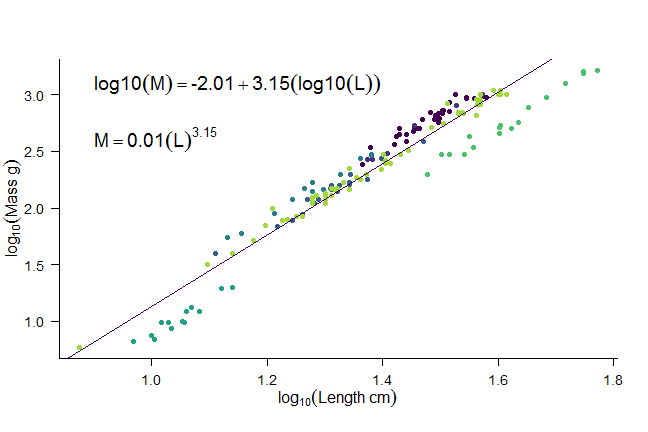
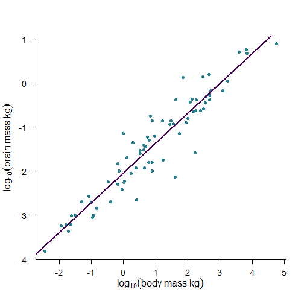

--- &two-cols w1:48% w2:48%

## Scatter plot data

*** {name: left}

> - How are two measures related?
> - Are they correlated?
> - Can one explain variation in the other?
> - What is the relationship?
> - Can I make new predictions using the relationship?

*** {name: right}

 

--- &two-cols w1:48% w2:48%

## Are they correlated?

*** {name: left}

> - Both x and y data show variation
> - Question is: do they co-vary (vary together)?
   - Are large $x$ values associated with large $y$ values?
   - or are large $x$ values associated with small $y$ values?
> - Calculate a statistics falle the correlation coefficient ($r$) which 
takes values $-1 \leq r \leq +1$
> - test $r$ against a statistical distribution to get a p-value using 
`cor.test()`

*** {name: right}

 

--- 

## Let's ask a different question

> - Instead of...
> - Is there a relationship between $x$ and $y$
> - I want to know...
> - What _is_ the relationship between $x$ and $y$
> - Need to fit a line through the data and we can use this to describe what the 
relationship is, both verbally and mathematically

--- 

## A straight line
 

---

## A null hypothesis
 

--- &two-cols w1:58% w2:38%

## Residuals

*** {name: left}

 

*** {name: right}

> - Computer fits the line by minimising the residuals off the line
>- Strictly (for least squares fitting), it minimises the sum of the squares
of the residuals
> - $\sum (y_i - \hat{y_i}) ^ 2$

---

## Residuals are informative
> - tells us which data are larger than predicted, and which are lower
> - Should ideally be normally distributed around the line
> - Test this with visual plots like histograms or q-q plots
> - Should be evenly spread around the line with no obvious trend

--- &two-cols w1:48% w2:48%

## Back to our line

*** {name: left}

> -  This figure shows how much algal growth occurs in one week in freshwater 
lakes of varying pollution levels
> -  It would be useful for us to know how much pollution affects algal growth
> -  It would also be useful if we could make predictions for growth rates in 
lakes we havent been able to observe such as:
> -  pristine unpolluted lakes
> -  or lake with exactly 2.2 mg/L pollution.

*** {name: right}

 

