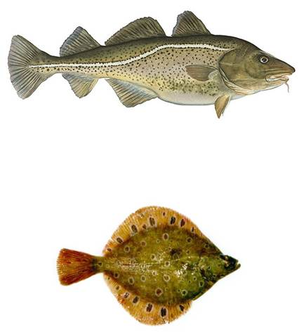
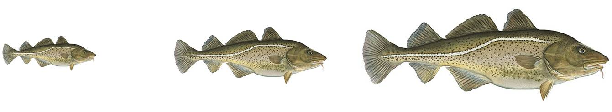
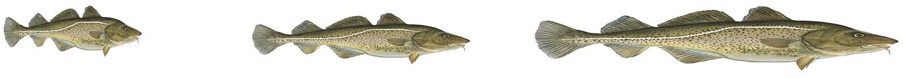
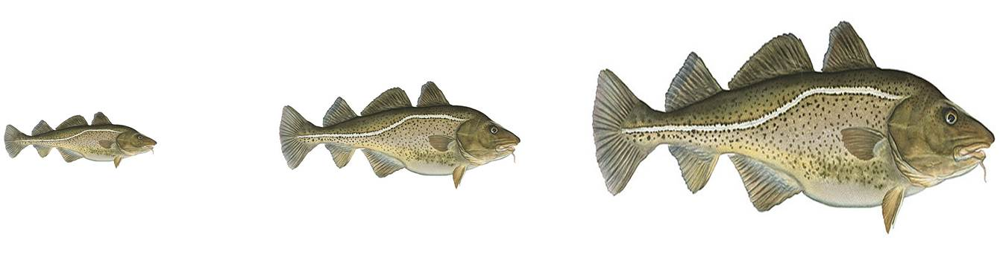

## Still just linear regression
But now with log transformed data on the x and y axes


```{r setup, echo = FALSE}
# set some global knitr build options, notably the default figure size
knitr::opts_chunk$set(collapse = TRUE, comment = "#-",
                      fig.width = 5, fig.height = 5)

# load the viridis package for pretty and accessible colours especially for those with 
# colour blindness. You will need to install this if you dont have it already using
# install.packages("viridis")
library(viridis)

# Here I create a palette of 8 colours from the viridis spectrum. I can then access these colours
# within plotting commands by e.g. plot(0,0, col = 1), or plot(0,0, col = 4) or plot(0,0, col = 8).
# This palette is also useful as it will print clearly in greyscale without any extra effort.
# see vignette for viridis for more details.
palette(viridis(8))

```

```{r brain_regression_1, fig.width = 9, fig.height = 6, echo = FALSE}

# read in the data
mydata <- read.csv("assets/data/brain-data.csv", header = T )

# Im going to convert to kilograms so we get some numbers less 
# than 1 for this example
mydata$brain <- mydata$brain / 1000
mydata$body <- mydata$body / 1000

# plot the log transformed data as a scatter plot
plot(log10(mydata$body), log10(mydata$brain),
     pch = 19, las = 1, bty = "L",
     xlab = expression(log[10](body~mass~kg)),
     ylab = expression(log[10](brain~mass~kg)),
     cex.lab = 1.3,
     cex.axis = 1.2,
     col = 4,
     mgp = c(2.5, 1, 0))
abline(glm(log10(brain)~log10(body), data = mydata), col = 1, lwd = 2 )


```


--- .class #id 

## Focus on length-mass relationships

- How does the mass of an organism scale with its length?
- Scaling is related to interesting biological and ecological processes
   - Metabolic costs
   - Transport of molecules over membranes
   - Predation or fishing / harvesting
   - Diet
   - Ecological scaling laws (abundance and biomass)

--- .class #id 

## Scaling of simple shapes

- How does a cube scale with its length?
- $Mass = Density * Volume$
- Assume density stays the same no matter what size, so $Mass \propto Volume$
- $Volume = L_1 * L_2 * L_3$
- $Volume = a * L ^ b$
- So if the cube stays the same shape (i.e. it remains a cube)
   - How does mass change if length is doubled?
   - $Volume = 2L_1 * 2L_2 * 2L_3 = 2 * L ^ 3$
- Isometric scaling is when the object stays the same shape as it grows or shrinks

--- &two-cols w1:58% w2:38%
## Spherical cows

*** {name: left}
> - How does mass of a sphere change with length?
> - $Volume = \frac{4}{3} * \pi * r ^ 3$
> - It is more normal to measure the length, not radius of an animal so...
> - $Volume = \frac{4}{3} * \pi * \frac{L^3}{2^3}$ 
> - $Volume= \frac{4}{3} * \pi * (\frac{L}{2})^3
= \frac{4}{3*8} * \pi * L^3$
> - Again, $Volume$, and hence $Mass$ changes with $Length^3$
> - So, generally we have...
> - $Volume = (some ~ number) * L^3$
> - $Volume = a * L ^ b$
> - Where for isometric scaling of $Volume$ (or $Mass$) with $Length$, $b = 3$

*** {name: right}


--- .class #id 

## A general equation for scaling of Mass to Length
> - $Mass = a * Length ^ b$
> - Take the Log of both sides (doesnt matter what logarithmic base)
> - $\log(M) = \log(a * L ^ b)$
> - $\log(M) = \log(a) + \log(L^b)$
> - $\log(M) = \log(a) + b * \log(L)$
> - which is the equation of a line
> - $Y = b_0 + b_1 * X$
> - where... $\log(a) = b_0$
> - so... $a = 10^{b_0}$ (assuming we are using logs in base 10)
> - and... $b_1 = b$ and is simply the power in the allometric equation

--- &two-cols w1:68% w2:28%

##  What do these coefficients mean? - Intercept

*** {name: left}

> - on a log-log scale what does the intercept mean?
> - $\log(M) = b_0 + b_1 * \log(L)$
> - the intercept is the coefficient, or multiplier of $Length$
> - $M = 10^{b_0} * Length ^ {b_1}$ (again assuming base 10)
> - Recall that spheres and cubes only differ in their coefficients
> - $Volume_{cube} = [1] * L^3$
> - $Volume_{sphere} = [\frac{4}{3*8} * \pi] * L^3$
> - So, $b_0$, our intercept, which in the allometric equation is $10^{b_0}$ 
tells us that the shapes differ between two species, and in some ways might tell
us how

*** {name: right}



--- .class #id 

##  What do these coefficients mean? - Slope
If the coefficient of $\log_{10}(Length)$ is exactly 3, then the fish are growing 
isometrically and staying exactly the same shape. that is their width and depth 
is growing in proportion to their length.



--- .class #id 

##  What do these coefficients mean? - Slope
If the coefficient of $\log_{10}(Length)$ is less than 3, then the fish are putting on less 
mass than you would predict which means their width and/or depth is not 
increasing in proportion to their length and they are becoming thinner as they 
get longer.



--- .class #id 

##  What do these coefficients mean? - Slope
If the coefficient of $\log_{10}(Length)$ is greater than 3, then the fish are putting on 
more mass than you would predict which means their width and/or depth is not 
increasing in proportion to their length and they are becoming broader as they 
get longer.



--- &vcenter

##  Mass - Length scaling in Finnish Fish
```{r finnish_fish_1, fig.width = 9, fig.height = 6, echo = FALSE, message = FALSE}

library(rrcov, verbose=F, quietly=T)
data("fish")

with(fish[complete.cases(fish) & fish$Weight>0,],{

# plot the log transformed data as a scatter plot
plot(log10(Length1), log10(Weight),
     pch = 19, las = 1, bty = "L",
     xlab = expression(log[10](Length~cm)),
     ylab = expression(log[10](Mass~g)),
     cex.lab = 1.3,
     cex.axis = 1.2,
     col = Species,
     mgp = c(2.5, 1, 0))


m1 <- glm(log10(Weight)~log10(Length1), data = fish[complete.cases(fish) & fish$Weight>0,])

# add the glm line to the plot
abline(m1, col = 1 )

# print the equation on the plot
m1_coef <- round(coef(m1), 2) # extract coefficients 
text(0.9, 3,
     bquote( log10(M) == .(m1_coef[1]) + .(m1_coef[2]) * (log10(L)) ),
     cex = 1.6, adj = c(0,0))
text(0.9, 2.5,
     bquote( M == .(round(10^m1_coef[1], 3)) * (L) ^ .(m1_coef[2]) ), 
     cex = 1.6, adj = c(0,0))

}) # end with() statement

```


--- &radio
## Question

With a scaling relationship of $Mass = 0.01 * Length ^ {3.15}$, is mass scaling:

1. Isometrically
2. _Faster_
3. Slower

*** .hint
Isometric scaling for mass which is directly proportional to volume would be to power 3

*** .explanation
3.15 is larger than 3, so these fish are putting on more mass for a given length as they get larger.

--- &two-cols w1:48% w2:48%
## Exactly how much of an increase?

*** {name: left}
> - This is just a linear equation
> - $\log_{10}(M) = -2.01 + 3.15 * \log_{10}(L)$
> - so a one unit increase in $\log_{10}(L)$ leads to a 3.15 unit increase 
in $\log_{10}(M)$
> - but these are in $\log_{10}$ units...
> - ... and in raw terms means a proportional (multiplicative) increase.


*** {name: right}

```{r finnish_fish_2, fig.width = 9, fig.height = 6, echo = FALSE}

with(fish[complete.cases(fish) & fish$Weight>0,],{

# plot the log transformed data as a scatter plot
plot(log10(Length1), log10(Weight),
     pch = 19, las = 1, bty = "L",
     xlab = expression(log[10](Length~cm)),
     ylab = expression(log[10](Mass~g)),
     cex.lab = 1.3,
     cex.axis = 1.2,
     col = Species,
     mgp = c(2.5, 1, 0))
  
  
m1 <- glm(log10(Weight)~log10(Length1), data = fish[complete.cases(fish) & fish$Weight>0,])

# add the glm line to the plot
abline(m1, col = 1 )

# print the equation on the plot
m1_coef <- round(coef(m1), 2) # extract coefficients 
text(0.9, 3,
     bquote( log10(M) == .(m1_coef[1]) + .(m1_coef[2]) * (log10(L)) ),
     cex = 1.6, adj = c(0,0))
text(0.9, 2.5,
     bquote( M == .(round(10^m1_coef[1], 3)) * (L) ^ .(m1_coef[2]) ), 
     cex = 1.6, adj = c(0,0))

}) # end with() statement

```

--- &radio
## Question

If $\log_{10}(Length)$ increases by one unit, how much does $Length$ increase by?

1. + 10 grams
2. + 9 grams
3. _10 times larger_
4. 100 times larger

*** .hint
$10 = \log_{10}(1)$

*** .explanation
If we consider we have $y = \log_{10}(x)$ and add one $y$ then we have $y + 1 = 1 + \log_{10}(x)$ which is 
equal to $y + 1 = \log_{10}(10) + \log_{10}(x)$ which by applying the rule `log of product is sum of logs` 
gives us $y + 1 = \log_{10}(10 * x)$. So, a one unit increase in $y$ which reprents $\log_{10}(x)$ results in an increase in $x$ by a multiplication of 10. 

--- &two-cols w1:48% w2:48%
## Exactly how much of an increase?

*** {name: left}

> - $\log_{10}(M) = -2.01 + 3.15 * \log_{10}(L)$
> - so a one unit increase in $\log_{10}(L)$ leads to a 3.15 unit increase 
in $\log_{10}(M)$
> - which translates into: every 10-fold increase in $Length$ results in a 
$10^{3.15} = 1413$ proportional increase in $Mass$.
> - So $L \mapsto 10*L$ means 
$M \mapsto 10^{3.15} * M = 1413 * M$
> - or, which might make more sense in this scale of data, a 0.1 or 10% increase 
in $Length$ results in a $10^{0.315} = 2.1 \approx 2$ which is an  
approximate doubling in $Mass$


*** {name: right}

```{r finnish_fish_3, fig.width = 9, fig.height = 6, echo = FALSE}

with(fish[complete.cases(fish) & fish$Weight>0,],{

# plot the log transformed data as a scatter plot
plot(log10(Length1), log10(Weight),
     pch = 19, las = 1, bty = "L",
     xlab = expression(log[10](Length~cm)),
     ylab = expression(log[10](Mass~g)),
     cex.lab = 1.3,
     cex.axis = 1.2,
     col = Species,
     mgp = c(2.5, 1, 0))
  
  
m1 <- glm(log10(Weight)~log10(Length1), data = fish[complete.cases(fish) & fish$Weight>0,])

# add the glm line to the plot
abline(m1, col = 1 )

# print the equation on the plot
m1_coef <- round(coef(m1), 2) # extract coefficients 
text(0.9, 3,
     bquote( log10(M) == .(m1_coef[1]) + .(m1_coef[2]) * (log10(L)) ),
     cex = 1.6, adj = c(0,0))
text(0.9, 2.5,
     bquote( M == .(round(10^m1_coef[1], 3)) * (L) ^ .(m1_coef[2]) ), 
     cex = 1.6, adj = c(0,0))

}) # end with() statement

```

--- &two-cols w1:48% w2:48% bg:yellow
## Return to brain size evolution


*** {name: left}


*** {name: right}


--- &two-cols w1:48% w2:48%

## Brain - Body mass scatterplot  


*** {name: left}

> - Now we are not modelling $Mass \sim Length$
> - but rather $Mass \sim Mass$

*** {name: right}

```{r brain_regression_2, echo = FALSE}
# plot the log transformed data as a scatter plot
plot(log10(mydata$body), log10(mydata$brain),
     pch = 19, las = 1, bty = "L",
     xlab = expression(log[10](body~mass~kg)),
     ylab = expression(log[10](brain~mass~kg)),
     cex.lab = 1.3,
     cex.axis = 1.2,
     col = 4,
     mgp = c(2.5, 1, 0))
abline(glm(log10(brain)~log10(body), data = mydata), col = 1, lwd = 2 )

```

--- &radio
## Question

What exponent would we expect $b$ to take in this equation if $brain ~ mass$ scales 
isometrically with $body ~ mass$?

1. _1_
2. 2
3. 3
4. 4

*** .hint
Both brain mass and body mass are on the same scale of grams or kilograms 
(or similar), so if one of them doubles, what would you expect the other to do
if it was scaling at the same rate?

*** .explanation
If brain size increases at the same rate as body size, we would expect the 
proportion of body mass that is brain mass to remain the same regardless of 
the size of the organisms. That is, $Mass_{brain} = a * Mass_{body} ^ 1$ or more
simply $Mass_{brain} = a * Mass_{body}$ where $a$ is the proportion of body mass 
that is brain mass or simply the ratio $a = \frac{Mass_{brain}}{Mass_{body}}$

--- &two-cols w1:48% w2:48%

## Brain - Body mass scatterplot  


*** {name: left}

> - So, a sensible model is $Mass_{brain} = a * Mass_{body} ^ 1$
> - which on $\log_{10}$ transformed data would mean we expect the 
coefficient of $\log_{10}(Mass_{body})$ to be $1$. 
> - In reality, would you expect this value to be greater than, equal to, or 
less than $1$?
> - what are the biological reasons that might govern this relationship?

*** {name: right}

```{r brain_regression_3, echo = FALSE}
# plot the log transformed data as a scatter plot
plot(log10(mydata$body), log10(mydata$brain),
     pch = 19, las = 1, bty = "L",
     xlab = expression(log[10](body~mass~kg)),
     ylab = expression(log[10](brain~mass~kg)),
     cex.lab = 1.3,
     cex.axis = 1.2,
     col = 4,
     mgp = c(2.5, 1, 0))
abline(glm(log10(brain)~log10(body), data = mydata), col = 1, lwd = 2 )

```

--- .class #id 

## Common allometric relationships

- $Length \propto Mass^{\frac{1}{3}}$
- $Surface Area \propto Mass^{\frac{2}{3}}$
- $Metabolic Rate \propto Mass^{\frac{3}{4}}$
- $Breathing rate or Heart rate \propto Mass^{\frac{1}{4}}$
- $Abundance \propto Mass_{body}^{\frac{3}{4}}$
    - [except parasites, which are weird!](http://dx.doi.org/10.1126%2Fscience.1204337)
    - blank
- blank

test

--- .class #id 

##  Key learning outcomes

> - Describe how change on a log scale affects the raw numbers
> - Linearise the allometric equation using log transformations
> - Use the equations fitted to data on log-log scale to make statements about proportional change in the response variable (y axis) as a function of proportional change in the covariates (x axis)


