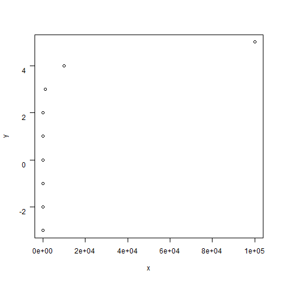

```{r, echo = FALSE}
# set some global knitr build options, notably the default figure size
knitr::opts_chunk$set(collapse = TRUE, comment = "#>", 
                      fig.width = 5, fig.height = 5)
```

```{r, echo = TRUE}

# Start off with some house-keeping and set-up.

# set the seed so I get the same random numbers each time this is run
set.seed(1)

# load the viridis package for pretty and accessible colours especially for those with 
# colour blindness.
library(viridis)

# Here I create a palette of 8 colours from the viridis spectrum. I can then access these colours
# within plotting commands by e.g. plot(0,0, col = 1), or plot(0,0, col = 4) or plot(0,0, col = 8).
# This palette is also useful as it will print clearly in greyscale without any extra effort.
# see vignette for viridis for more details.
palette(viridis(8))

```

## Log my data pretty

Log transformations ([logarithms](https://en.wikipedia.org/wiki/Logarithm) to give them their full name) are very often used in data analysis, primarily to acheive a normal distribution when faced with a skewed distribution. Remember, that the assumption of normality applies to the *residuals* of your model, ***not*** the *raw data* itself, so just because your data are themselves skewed, does not necessarily mean you need to apply a log transformation (or other); although in reality this would be highly suggestive that such a transformation will be required.

The application of log transformations to data is often undertaken without much thought as to what the transformation actually acheives, beyond taking what we have been trained to spot as an awful looking skewed distribution, and making it into what expect a pretty, normal distribution to look like for our analyses. Bear in mind though that rushing to transform your raw data is not a good way to start, and many analyses (such as some Generalised Linear Models) are designed to handle the transformation internally, so you dont want to go double transformating your data inadvertently.


Here is some R code to illustrate the effect log transformation has on some skewed data.

```{r, fig.width = 8, fig.height = 5}

# create some random numbers from a log-normal distribution
y <- rlnorm(100, meanlog = 0, sdlog = 1)

# create a 1x2 panel plotting window
par(mfrow=c(1,2))

# histogram of the raw data
hist(y, 30, main = "Raw data", col = 6)

# histogram of the log transformed data
hist(log(y), 30, main = "Log transformed data", col = 8)

```


## Definition of a log

So far, so good, but the log transformation is more than just an excercise in prettying up our data. This transformation fundamentally changes the nature of the scale of the data, and the relationship between the data points. While this transformation doesnt affect some basic interpretations of the output of our analyses such as "*there is a significant difference in the means of the two populations, p < 0.05*", it does change how we interpret the effect size or magnitude of the difference such that a difference of two units on the log-transformed data is not remotely the same as a difference in two units on the raw data scale.

To understand what log transformations do, and to avoid some common misunderstandings, we have to go back to the basic definition of a log... unweildy though it is:

***The log of a number to a certain base is the power to which you raise the base to get that number***

This is not exactly obvious or intuitive, but if we look at the mathematical form in which we write logs, it should start to become clearer.

$$\log_{10}(100) = 2$$

This equation can be read as: "the log of 100 to base 10 equals 2". Going back to our definition of a log, this means that: if we take our number ($2$) and raise the base ($10$) to this power ($10^2$) then we should get our number back again ($100$).

By way of checking: $10^2$ does indeed equal $100$.

Of course, we could use any base we wish to transform our data. The resultant numbers will obviously change and hence the interpretation of the transformation in terms of our data, but the principle remains the same. There are only two common transformations used in biology and environmental sciences: base 10 and base e. Where this rather magical number $e$ comes from is a topic for another day, but for our purposes it is just a number and is approximately $e = 2.718282$. The point is that although the resultant numbers will change under different choices of base for your log transformation, the principle involved remains the same (the details of this will become clearer later). One important thing to remember, is that in R, the function `log(y)` will default to base $e$. To get base 10, you either need to use `log(y, 10)` or more intuitively, `log10(y)`

It is also worth, at this stage, writing out what powers do to numbers in long hand

- $10^2 = 10 * 10 = 100$
- $10^5 = 10 * 10 * 10 * 10 * 10 * 10 = 100000$

That is, *powers* are repeated *multiplications* of a number by itself.

This contrasts to *multiplication* which is a repeated *addition* of a number to itself... 

- $2*10 = 10 + 10$ 
- $5*10 = 10 + 10 + 10 + 10 + 10$

We will come back to this distinction as it is key to understanding logs and what they do to numbers.

## Logs fundamentally change the scale between the numbers: Hypothetical voles and other animals

Log transformations clearly change the magnitude of numbers. We saw this above where our randomly generated numbers went from approximately 0 to 10 on their raw data scale, but then to -2 to +2 on the log transformed scale. The other thing that happened though is that under the log transformation, the smaller raw numbers got stretched further apart from each other, while the bigger numbers got pulled in closer. This is perhaps more easily seen and understood if we turn to some animal body mass data.

```{r, fig.width = 8, fig.height = 5}

# read in the data
mydata <- read.csv("brain-data.csv", header = T )

# Im going to convert to kilograms so we get some numbers less than 1 for this example
mydata$brain <- mydata$brain / 100
mydata$body <- mydata$body / 100

# plot the raw and log transformed data

# create a 1x2 panel plotting window
par(mfrow=c(1,2))

# histogram of the raw data with grams converted to kg
hist(mydata$body, 20, main = "Raw data", col = 2, xlab="body mass (Kg)")

# histogram of the log transformed data with grams converted to kg
hist(log10(mydata$body), 20, main = "Log transformed data", col = 4, xlab = "log10(body mass (Kg))")

```

Let's take a look at some key numbers throughout the dataset. Our smallest animal in this dataset is the Hummingbird at 0.04 Kg. Volves tend to get a bit smaller, and can be less than 2g so lets just use 1g or 0.001Kg as our starting point. We then have approximately:

| Species       | Body Mass (Kg) | log10 body mass  |
| ------------- |:-------------: | :-----:          |
| Vole          | 0.01           | -2               |
| Reed warbler  | 0.1            | -1               |
| Least weasel  | 1              |  0               |
| Dog (beagle)  | 10             |  1               |
| Ocelot        | 100            |  2               |
| Jaguar        | 1000           |  3               |
| Orca          | 10000          |  4               |
| Blue Whale    | 100000         |  5               |

Starting with our hypothetical vole, the reed warbler, small though it is itselft is a whopping 10 times larger than the vole. This same step in increasing size happens as we move down our table of species, with each next animal being 10 times the body mass of the previous. In absolute terms though, the difference clearly changes as we move from making comparisons between two small animals, with two large animals. The difference in body mass between the weasel and dog is only 9 Kg compared with the difference between the Jaguar and Orca which is 9000 Kg. This is the feature of the data that makes it highly skewed when we plot the distribution of raw body massses as a histogram: the smaller animals are common and all bunched up together with not many kilgrams separating them, while the larger animals are both rarer and very much further apart from each other. In fact, the gap in terms of kilograms between animals grows faster the larger they get.

Compare this pattern to the $log10$ transformed body masses. We start with our vole at $-2$. This negative number might seem odd, but let's check: $10^{-2} = (1/10) * (1/10) = 0.01$ so thats ok! Now as we move to our warbler, the log10 body mass has gone up by 1 unit. Then as we move to the weasel we see its gone up by 1 unit again (check yourself why $log_{10}(1) = 0$). In fact, as we move down our table of animals, the log10 body mass is only going up by a 1 unit increase each time.

This is fundamental property of logs and why they work as they do. What is happening here is that the raw body masses are increasing ***multiplicatively*** (we use the term proportionally here more commonly) with each step, whereas the log10 body masses are increasing ***additively*** with each step.

In graphical terms, this takes the vole and read warbler and moves them further apart (1 unit rather than 0.09) and moves the blue whale and orca closer together (1 unit rather than 90000).

## But I prefer watching cartoons to all this maths

You can visualise this transformation with an animation of the transition for our approximate animal body masses.

```{r, message=FALSE}

# load required libraries
library(berryFunctions)
library(animation)

# a series of log10 body masses to consider
log.y <- -2:5 

# their kg counterparts
y <- 10 ^ log.y

# plot and animate the transition
saveGIF(linLogTrans(y, log.y, base=10, steps=100), interval = 0.2, 
        movie.name = "animated-log.gif" )

```



What we see here is an animation of the body mass data from our table above (voles to whales). The y-axis indicates the $log_{10}$ body masses. The x-axis starts off with the points located on the raw kilogram scale with all the small ones bunched up, and then skewed with a long tail out towards the bigger animals that get progressively further apart. The data points on the x-axis then move towards their ultimate position on their corresponding $log_{10}$ scale while retaining their labelling in kilograms. This animation starts at time `t = 0` and progresses to conclusion somewhere arbitrarily around 't = 316'. The notation `x^(1/t)` just refers to the animation process of where `x` is at time `t` of the animation process. What you can see to whales). On the y-axis is the $log_{10}$ transformed body mass. The raw data start off on the x-axis where they would be on raw data scale. The yellow vertical lines let you see how the body mass for large animals become compressed, while the smaller body masses get stretched out during the transformation.


## Its time for that talk on the birds and er... mammals
One then needs to bear this in mind when interpreting differences on log transformed data. Take this comparison between the body masses of some birds and mammals (not a great comparison from an insight point of view, but it makes the point). 

```{r}

# boxplot to see how the birds and mammals compare
# Note how to get R to render the log10 notation in the y axis label using the function expression().
boxplot(log10(mydata$body) ~ mydata$class, bty = "L", las = 1, ylab = expression(log[10](body~mass~(kg))), xlab = "Class")

# calculate the means
mu <- tapply(log10(mydata$body), mydata$class, mean)

# add this to the graph (for hoots)
points(1:2, mu, pch = 19, col = 1)

```

In this example, the birds have a mean log10 body mass of 0.4 while the mammals are 2.3. In real terms, this converts to the birds having a mean body mass of $10^{0.4} = 2.5g$ and the mammals $10^{2.3}=200$. The difference between the two on the log scale is $2.3 - 0.4 = 1.9$. Interpreting this on the actual bioligically meaningful scale of kilgrams, which means that there is a proportional difference of $10^1.9 \approx 79$ between the mammals and birds. So, the mammals, at 199.5Kg are approximatately 79 times the body mass of birds (give or take some rounding errors we have let creep in here): $2.5 * 79 = 197.5 \approx 200$ or alternatively, the birds are 79 times smaller than the mammals $197.5 / 79 = 2.5$.

In more general terms, a difference of $\Delta X$ between two numbers on the $log_{10}$ scale translates into a proportional difference on the raw data scale of $10^{\Delta X}$

## Doing maths with logs
As we just saw with the example of what differences between two numbers on log scale means on the raw scale, there are some key mathematical properties of logs that are worth noting. It would be worth while to try these out by swapping in some real numbers for my lazy a's and b's... and bear in mind the base might change should you find yourself using the natural log $Ln = \log_{e}$ as will happen internally in some Generalised Linear Models.

- $log_{10}(a) + log_{10}(b) = log_{10}(a*b) = 10^{a*b}$
- $log_{10}(a) - log_{10}(b) = log_{10}(a/b) = 10^{a/b}$
- $log_{10}(a^b) = b*log_{10}(a)$
- $log_{10}(a+b) = 10^{a+b} = 10^{a}*10^{b}$ 
    - N.B. this one is ***really*** important for understanding linear regressions on log-transformed data.


## (Re-) Capitulation

- log transformations are commonly used to "fix" skewed data and make them normal(-ish).
- they are not magic.
- logs take differences between numbers (data) that are on a *multiplicative* scale, and turn them into differences on an *additive* scale.
    - they move numbers that are small further apart
    - they move numbers that are big closer together
    - differences on a logarthmic scale become proportional on the linear (raw) scale
- If in doubt, do some maths on a piece of paper with R close by to help you!


